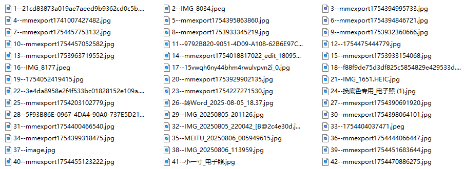
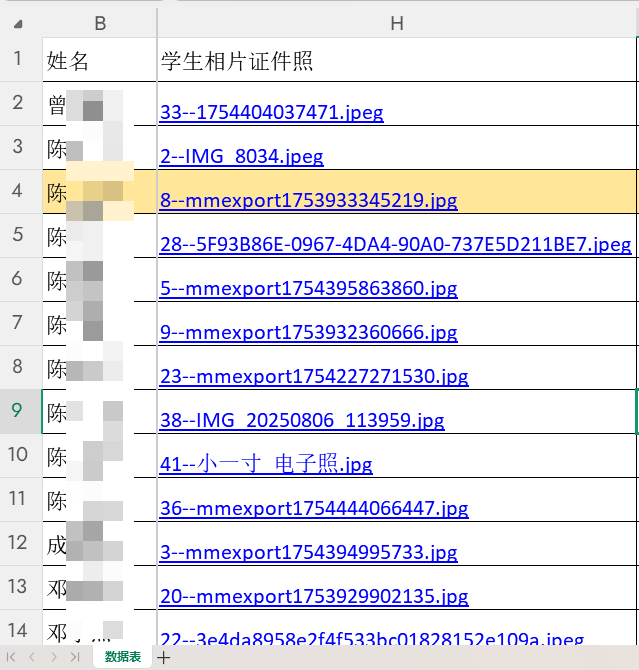
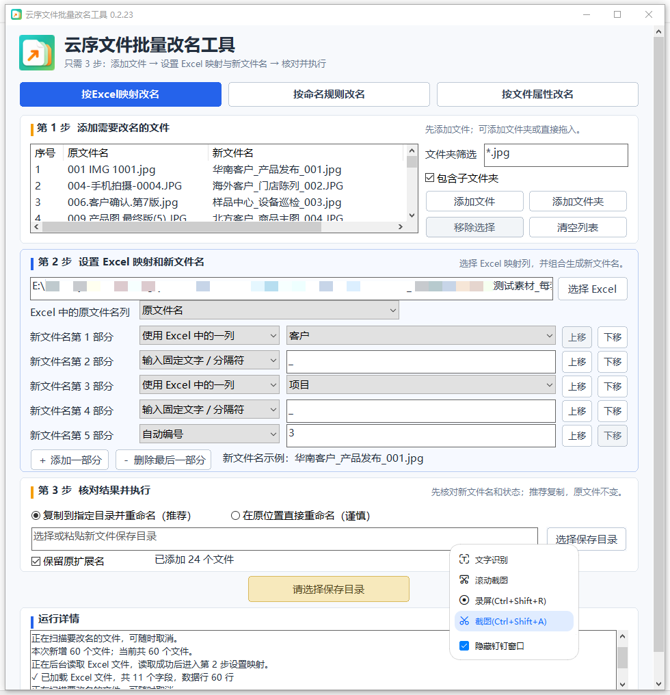
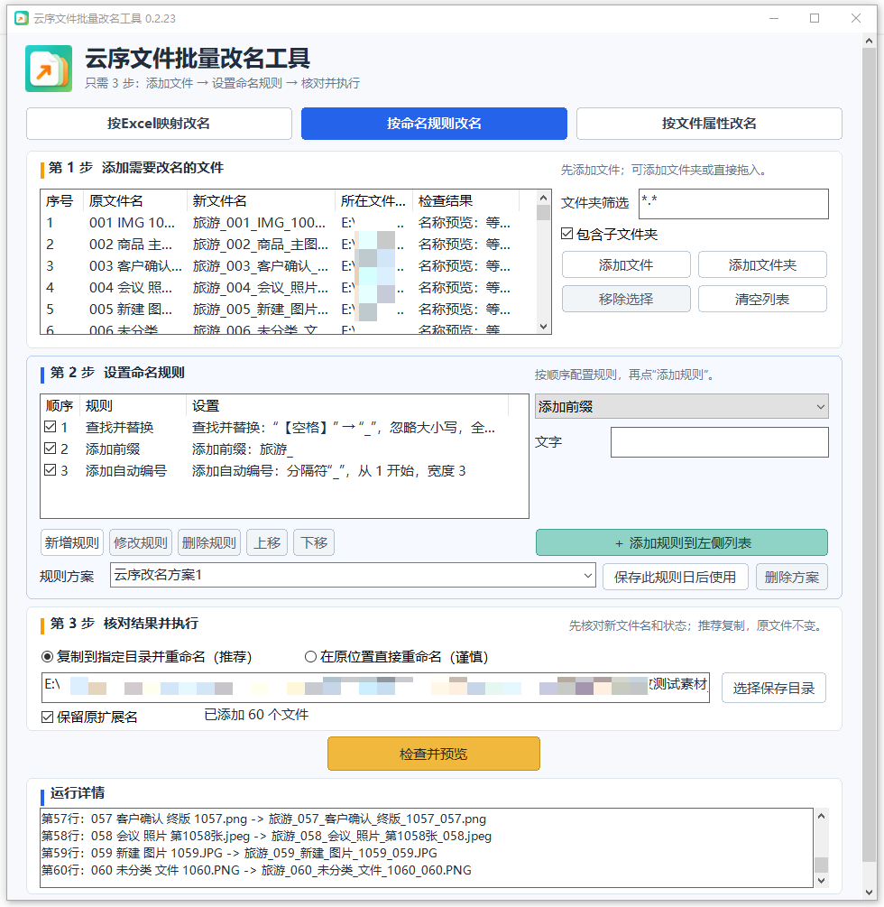
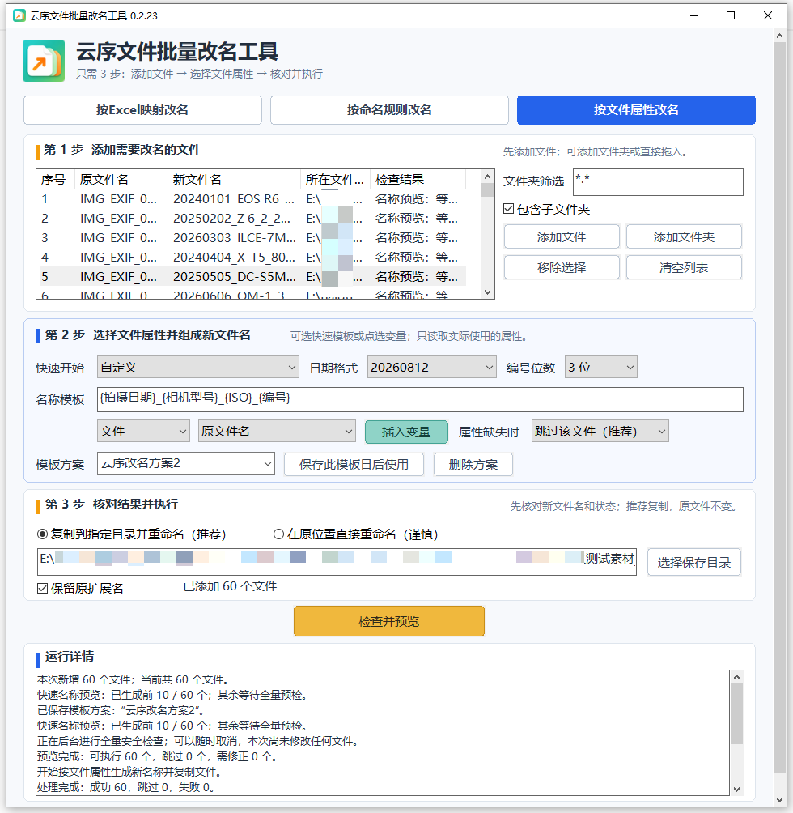

# 云序文件批量改名工具

> 用三种用法，应付最常见的改名。

**云序文件批量改名工具**是一款面向 Windows 的本地批量改名工具，支持：

- 按 Excel 映射改名
- 按命名规则改名
- 按文件属性改名

软件在本机处理文件，不需要把照片、表格、音乐、视频或工作资料上传到网络。

## 为什么做这个工具

最初只是为了处理一个很具体的问题：  
网络表单收上来的学生证件照，下载后文件名五花八门，但做校卡、学籍、档案时，又常常需要按不同规则重新命名。

而 Excel 中其实已经有“姓名”和“原照片文件名”的对应关系：

手工改几十、几百个文件当然可以，但既费时间，也容易出错；涉及学生照片、身份证号等资料时，也不适合随意上传到网络处理。

于是有了这个工具。

## 三种改名方式

### 1. 我有一张 Excel，要对着它改

Excel 里已有“原文件名”与姓名、编号或其他字段的对应关系时，可以直接按指定列组合生成新文件名。

例如：

- 校卡：`班级_姓名.jpg`
- 学籍：`身份证号.jpg`
- 档案：按另一套字段重新组合

### 2. 没有表格，就按规则批量套

支持把多种规则组合起来使用，例如：

- 添加前缀
- 添加后缀
- 查找替换
- 删除文字
- 自动编号
- 日期
- 大小写转换
- 名称模板

常用规则还可以保存为方案，下次直接调用。

例如：

`IMG_001.jpg` → `桂林旅行_001.jpg`

`IMG_002.jpg` → `桂林旅行_002.jpg`

### 3. 文件里的信息，本来就有，直接拿来命名

照片、音乐、视频文件本身就带有很多可用信息，例如：

- 照片：拍摄日期、相机型号、分辨率
- 音乐：歌手、专辑、曲名
- 视频：创建日期、时长、分辨率、帧率

这些信息可以直接拿来组合文件名，不必另外制作对应表。

## 适合哪些场景

- 学生照片、人员资料
- 活动照片、摄影素材
- 音乐收藏
- 视频文件
- 扫描件
- 合同、项目资料
- 日常需要批量整理的大量文件

## 本地处理与隐私

软件主要在用户自己的 Windows 电脑上读取和处理用户主动选择的文件。

- 不要求注册账号
- 不需要把待改名文件上传到开发者服务器
- 不出售或共享用户文件内容
- 适合处理不便上传网络的照片、表格和工作资料

详细说明见：[隐私政策](https://qindagui.github.io/yunxu-file-renamer/privacy.html)

## 项目页面

- 产品主页：https://qindagui.github.io/yunxu-file-renamer/
- 隐私政策：https://qindagui.github.io/yunxu-file-renamer/privacy.html
- 技术支持：https://qindagui.github.io/yunxu-file-renamer/support.html
- 使用说明与责任提示：https://qindagui.github.io/yunxu-file-renamer/terms.html

## Microsoft Store

Microsoft Store 版本正在准备上架。

## 关于这个仓库

这个仓库目前主要用于托管：

- 产品介绍页面
- 隐私政策
- 技术支持页面
- Microsoft Store 上架所需的公开网页

**本仓库不是软件源代码仓库。**

---

开发者：**职校覃老师**  
GitHub：[@qindagui](https://github.com/qindagui)
